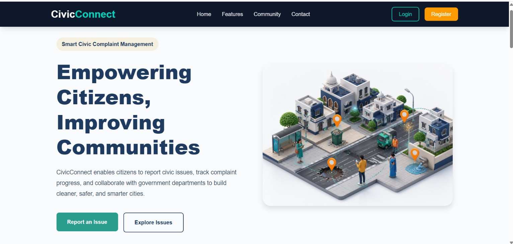
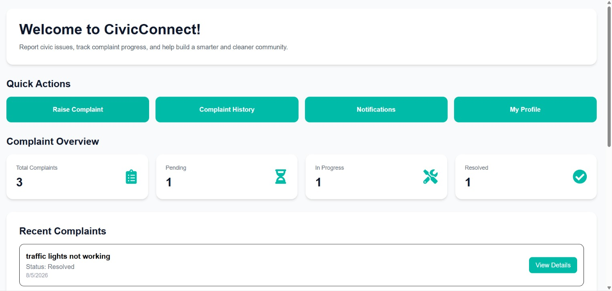
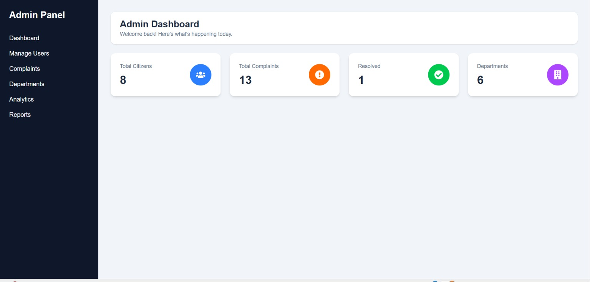
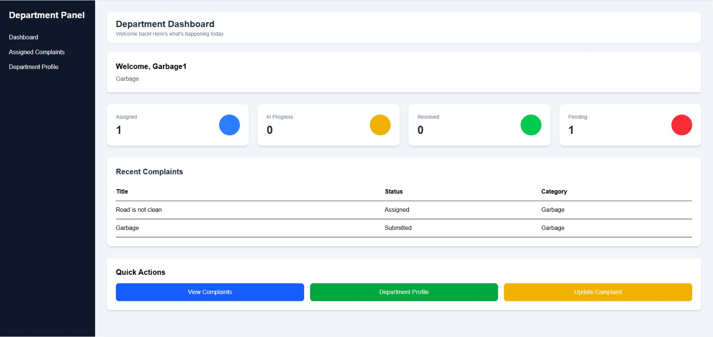
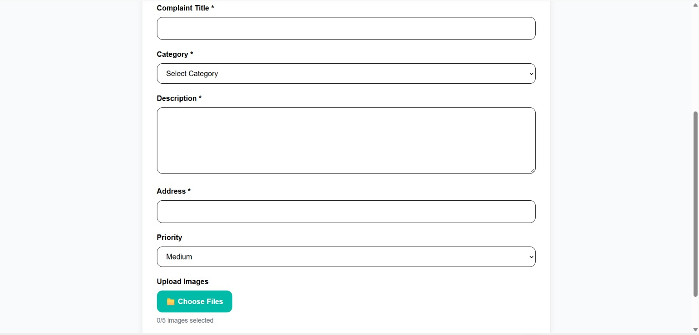
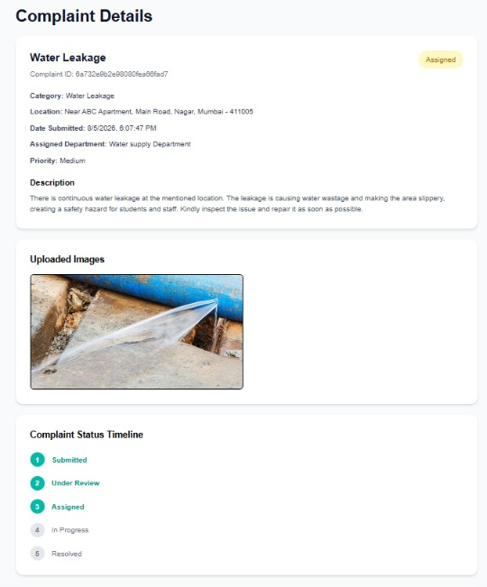
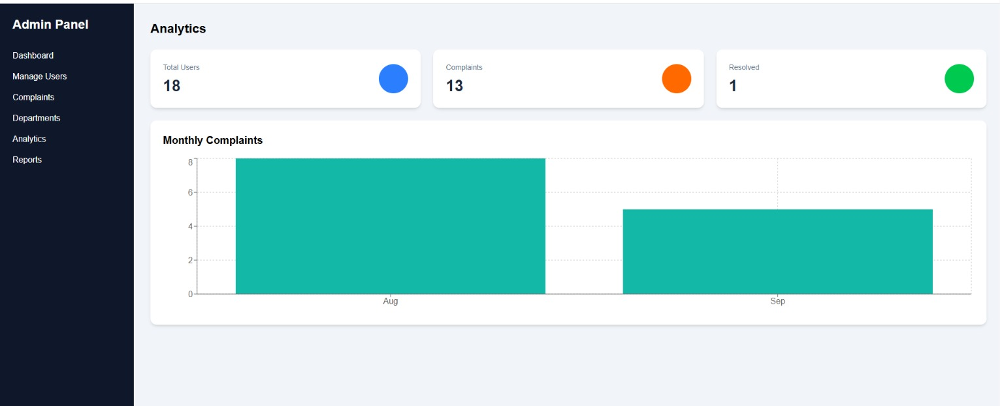

#  Civic Connect

### Connecting Citizens, Building Better Communities.

A full-stack civic issue reporting and management platform that connects citizens with government departments to report, track, and resolve civic issues efficiently.

## 🌐 Live Demo

- **Frontend:** [Civic Connect](https://civic-connect-platform.netlify.app/)
- **Backend API:** [Backend API](https://civic-connect-2uyw.onrender.com/)
## 📸 Screenshots

### 🏠 Home Page

### 👤 Citizen Dashboard

### 🛠️ Admin Dashboard

### 🏢 Department Dashboard

### 📝 Complaint Page

### 📋 Complaint Details

### 📊 Analytics Dashboard

